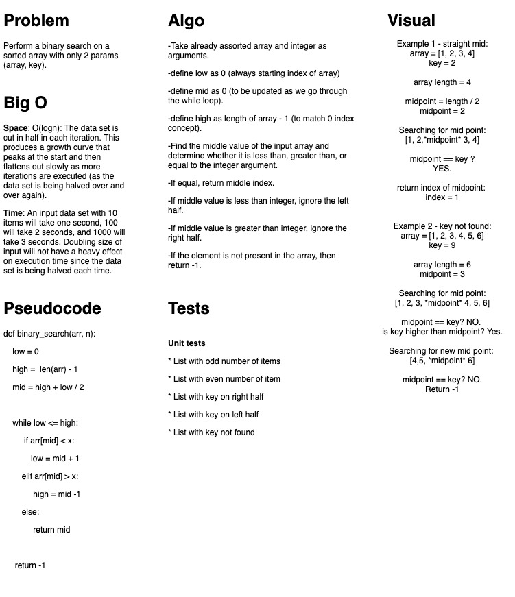

# Challenge Summary

Binary search

## Challenge Description

Perform a binary search on a list without using built in python methods. Function can only take 2 arguments.

## Approach & Efficiency

Iteratively performed binary search on the list.
Space: O(1)
Time: O(log n)

## Solution

