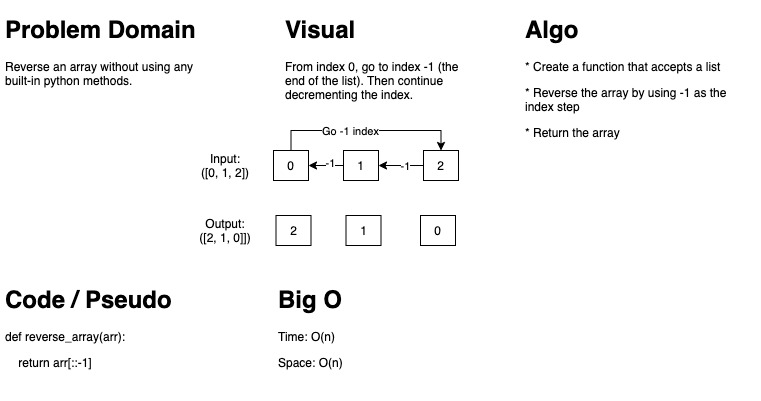

# Reverse an Array

Reversing an array (list) in Python.

## Challenge

A python function that will reverse an array without use of the built in reverse method.

## Approach & Efficiency

Index syntax was used to step through the array in reverse order.

## Solution

