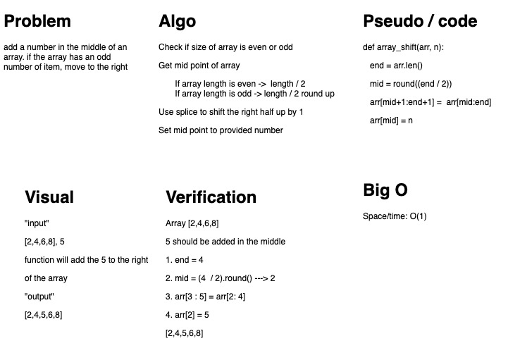

# Array Shift

Insert value at midpoint of an array.

## Challenge Description

Insert a value at the midpoint of an array. If the array has an odd number of item, the midpoint is considered the index to the right. No built in methods used.

## Approach & Efficiency

Slicing was used to shfit the array. O(1).

## Solution

