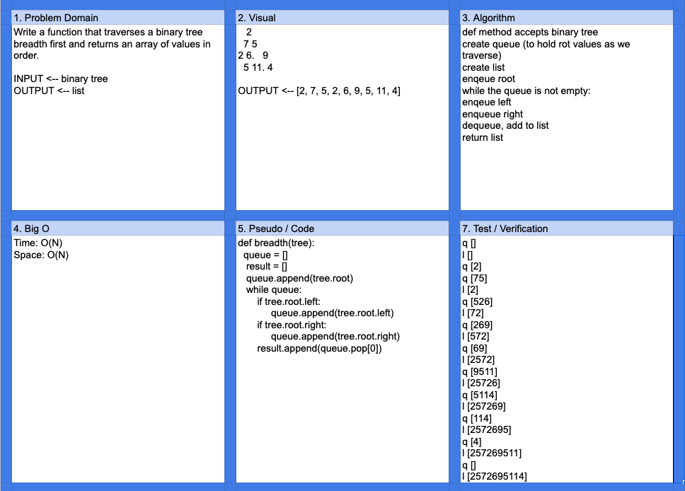

# Challenge Summary

Breadth first binary tree traversal

## Challenge Description

Write a breadth first traversal method which takes a Binary Tree as its unique input. Without utilizing any of the built-in methods available to your language, traverse the input tree using a Breadth-first approach, and return a list of the values in the tree in the order they were encountered.

## Approach & Efficiency

Queue was used to track the node to add to a list. While loop enqueues the nodes left/right, then dequeues to add to the list.  

- Space: O(n)
- Time: O(n)

## Solution

