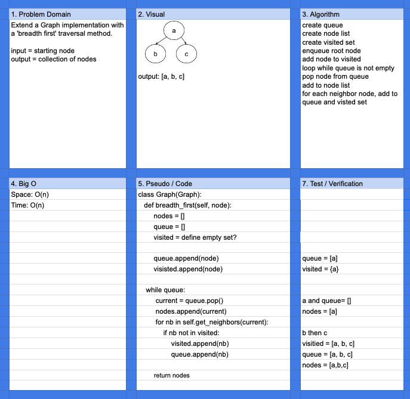

# Challenge Summary

Breadth first Graph traversal

## Challenge Description

Extend [Graph implementation](../../data_structures/graph/README.md) with a breadth first traversal method.

## Approach & Efficiency

Both Space and Time are O(n)

## Solution

