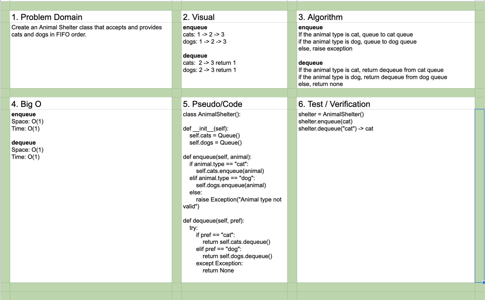

# Challenge Summary
Animal Shelter class accepting and providing cats and dogs.

## Challenge Description

Create an animal shelter class that hanndles cats and dogs in FIFO order.

## Approach & Efficiency

- Enqueue
  - Space: O(1)
  - Time: O(1)
- Dequeue
  - Space: O(1)
  - Time: O(1)
  
## Solution

