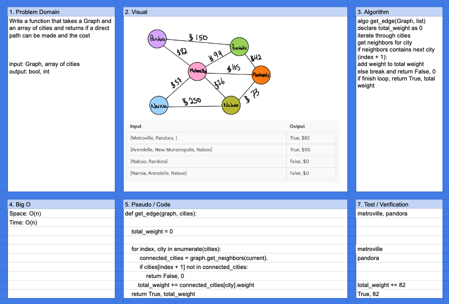

# Challenge Summary

Get Edges

## Challenge Description

Given a Graph and list of cities, return:

- Bool: whether a route can be created from the city list based on the graph
- Cost: Total weight from the graph route

## Approach & Efficiency

Both Space and Time are O(n)

## Solution

