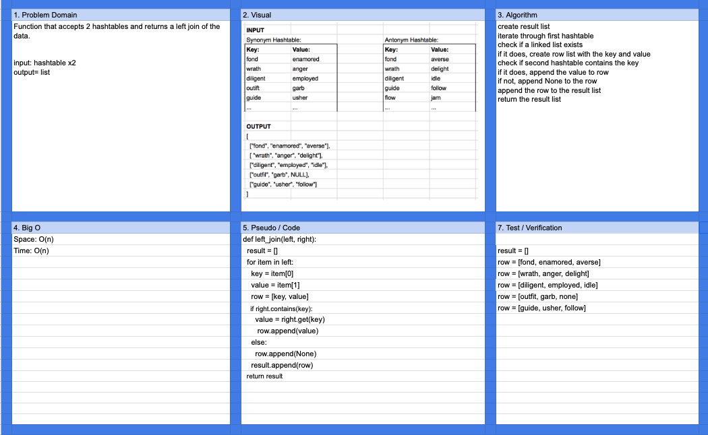

# Hashmap LEFT JOIN

Left join two hashmaps.

## Challenge

Given two hashmaps, return a data structure representing a left join. All key/value pairs in the left hashmap should be included, and keys also found in the right hashmap should have their values included.

## Approach & Efficiency

The first hashmap is iterated through. During the iteration, a row is 'built' containing the key and the corresponding value from either hashmap. The row is then appended to an array which is returned at the end of the iteration.

- Space: O(n)
- Time: O(n)

## Solution

