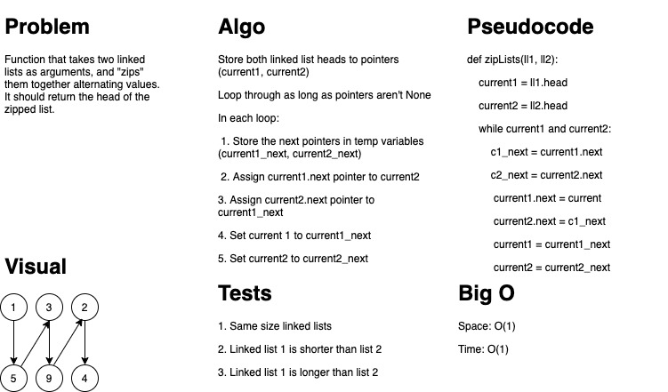

# Challenge Summary

"Zip" two linked lists, by alternating values between them.

## Challenge Description

Take two linked list and merge them by alternating values. Attempt to modify in place, keeping O(1).

## Approach & Efficiency

Looped through the lists, caching reference to next pointers.
Swap the current pointers in each loop. Space O(1), time O(n).

## Solution

