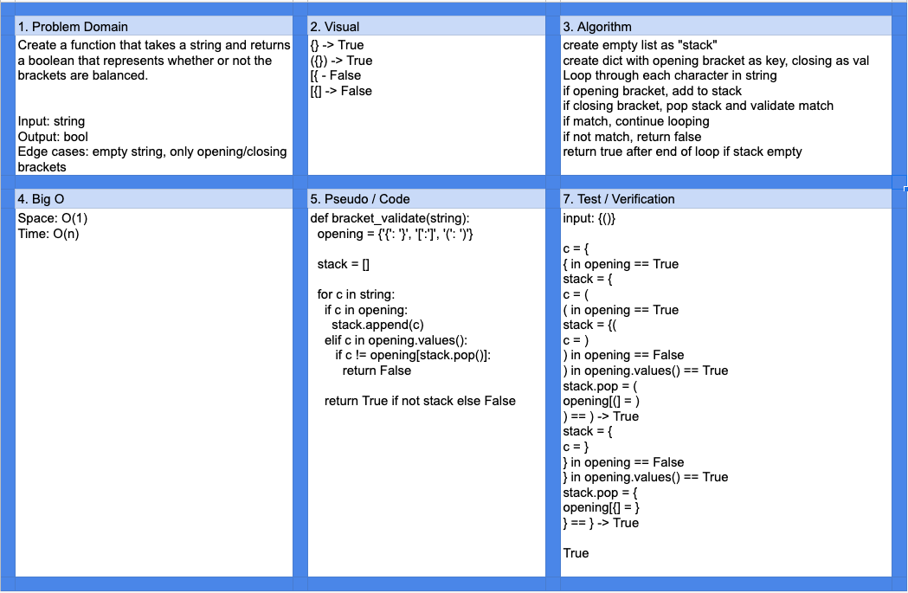

# Challenge Summary

Multi-bracket validation

## Challenge Description

Create a function that takes a string and returns a boolean that represents whether or not the brackets are balanced.

## Approach & Efficiency

Using a list as a stack, the string is iterated through. Opening brackets are pushed onto the stack. When a closing bracket is encountered, a value is popped from the stack to compare against.

Space: O(1)  
Time: O(n)

## Solution

