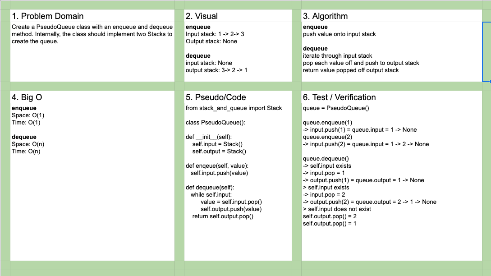

# Challenge Summary

Create a PseudoQueue class with an enqueue and dequeue method.

## Challenge Description

Create a PseudoQueue class with an enqueue and dequeue method. Internally, the class should implement two Stacks to create the queue.

## Approach & Efficiency

- Enqueue
  - Space: O(1)
  - Time: O(1)
- Dequeue
  - Space: O(n)
  - Time: O(n)

## Solution

