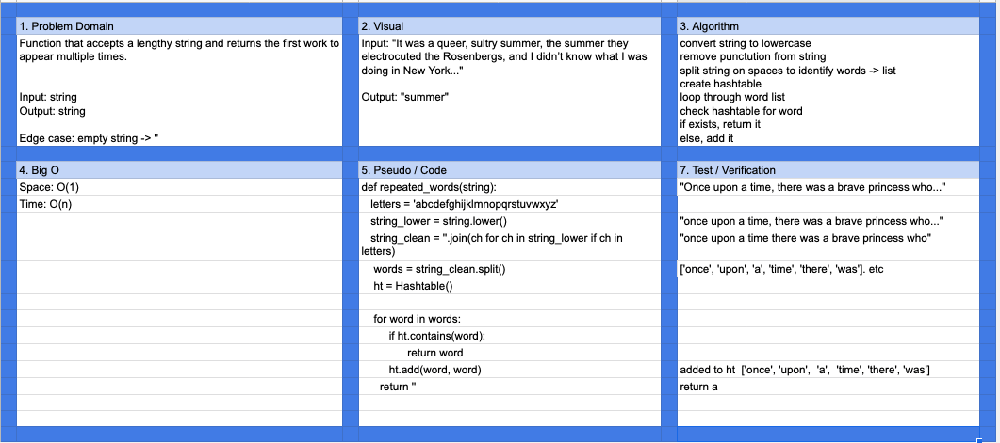

# Challenge Summary

Repeated Word

## Challenge Description

Create a function that accepts a lengthy string, and returns teh first word to appear multiple times.

## Approach & Efficiency

Used a hashtable to store unique words.

Space: O(1)  
Time: O(n)

## Solution

