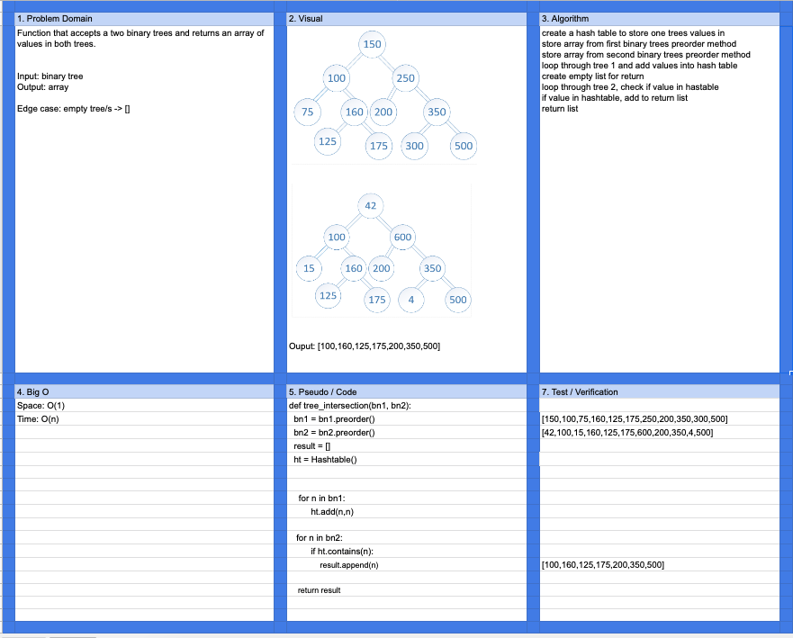

# Challenge Summary

Tree Intersection

## Challenge Description

Given two binary trees, return a list with all intersecting values.

## Approach & Efficiency

Hash table was used to store the contents of one tree to check for matches in the second tree with an O(1) lookup.

## Solution

