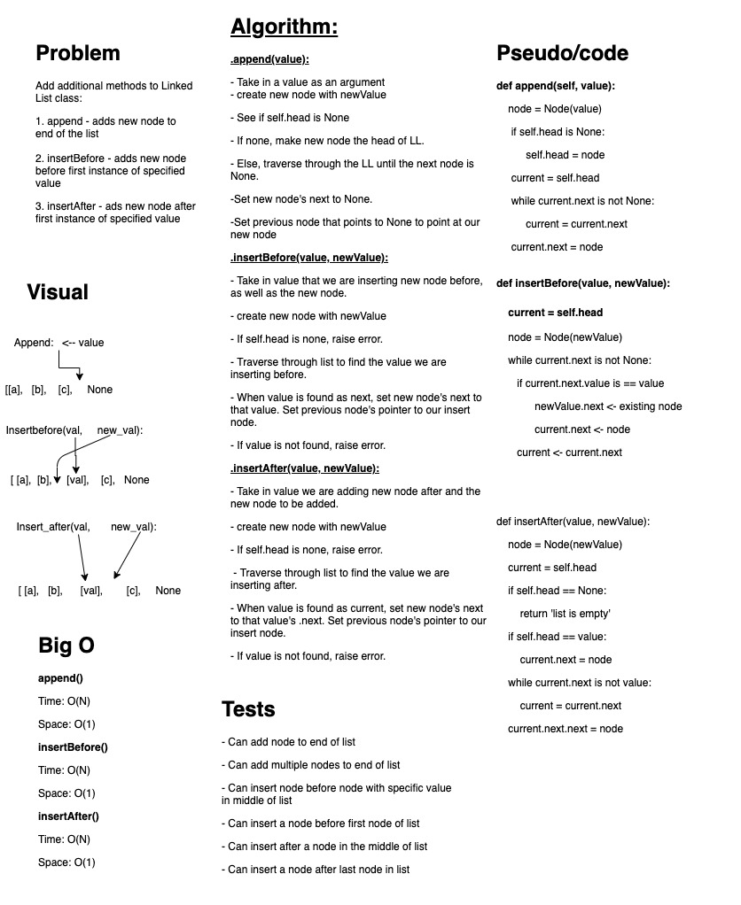
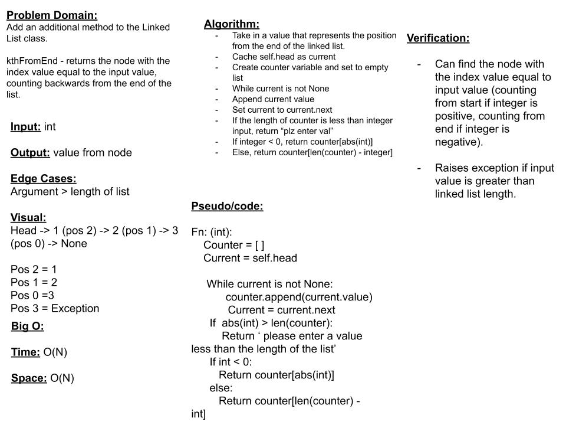

# Singly Linked List

Linked List implementation with Node and LinkedList classes

## Challenge

Create a Node class and Linked List class. The Linked List has has insert and inclues methods.

## Approach & Efficiency

The Node and Linked List are both classes. The Node class contains a 'next' value, and the linked list class contains a head value. Together, these allow traversal through the list. Insert is O(1), while includes is O(n).

## API

LinkedList

- `Insert`: Inserts a new Node with specified value to the head of the list.
- `Includes`: Returns a boolean based on a specified value existing in the list.

## Whiteboard

